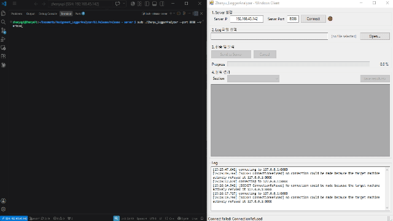
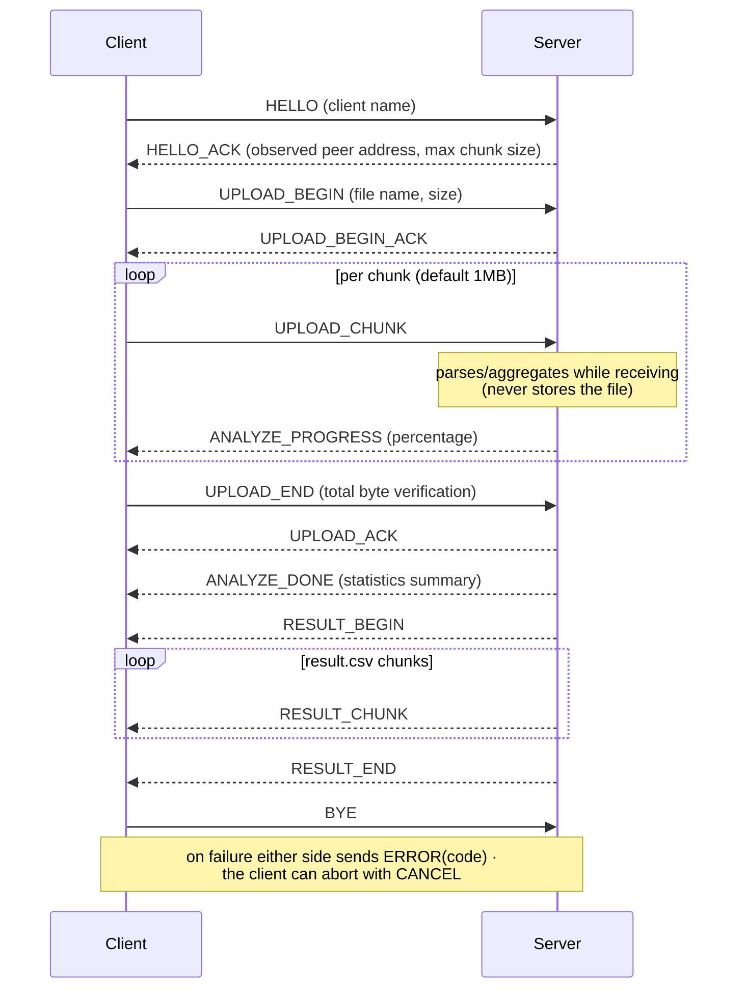

# Assignment_LoggerAnalyzer

A client-server system that uploads a large (~500MB) equipment log file over TCP,
parses and aggregates it on the fly, and returns the analysis result as `result.csv`.

- **Client**: Windows WinForms app (C#, .NET Framework 4.7.2) — file picker, upload, real-time progress, result download
- **Server**: Linux daemon (C++17, libuv) — streaming parse/aggregation on receive, resident memory stays at a few MB



## Repository Layout

```
Assignment_LoggerAnalyzer/
├── 01.Sources/
│   ├── CLIENT/                  # WinForms client source (Visual Studio solution)
│   │   └── Network/             # TCP layer (Protocol.cs = same wire contract as the server)
│   └── SERVER/                  # Linux server source (CMake project)
│       ├── 01.PreInstallation.sh    # 1) install build tools, SSH, firewall setup
│       ├── 02.build_project_linux.sh # 2) build libuv + build server + run
│       ├── 03.DaemonRegistration.sh # 3) register as a systemd daemon
│       ├── 3rdparty/            # bundled libuv (static) and spdlog (header-only)
│       ├── packaging/           # systemd service template
│       └── src/
│           ├── app/             # Config (CLI options), Daemon (double fork), Signals
│           ├── net/             # libuv TCP server, frame encoding/decoding
│           ├── parse/           # log line splitting and validation
│           ├── analyze/         # aggregation, CSV result generation
│           └── util/            # spdlog-based logger
└── 02.Release/
    ├── release - client/        # prebuilt Windows client (.exe)
    └── release - server/        # prebuilt Linux server (x86_64) + service file
```

## Quick Start (prebuilt binaries)

No build step required.

**Server (Linux):**

```bash
cd "02.Release/release - server"
chmod +x Zhenyu_LoggerAnalyzer
./Zhenyu_LoggerAnalyzer --port 8088 --verbose
```

**Client (Windows):**

Run `02.Release/release - client/Individual Assignment01_UI.exe`,
enter the server IP and port (default 8088), and connect.

> If the server runs on another machine, open TCP port 8088 in its firewall
> (`01.PreInstallation.sh` sets up the ufw rule automatically).

## Building from Source

### Server (Linux)

After `git clone`, run the scripts in this order:

```bash
cd 01.Sources/SERVER
bash 01.PreInstallation.sh            # once: install packages + SSH/firewall setup
bash 3rdparty/libuv/build_linux.sh    # once per machine: build bundled libuv against the local glibc
bash 02.build_project_linux.sh        # build server -> run
bash 03.DaemonRegistration.sh         # (optional) register systemd service: start at boot + auto-restart
```

- **Why build libuv first**: the repository ships a prebuilt `libuv_a.a`,
  but a static archive is tied to the glibc of the machine that built it.
  Rebuilding it locally (a few minutes, once per machine) guarantees the
  link succeeds. If you skip this step and the glibc versions differ, the
  final link fails with errors like
  `undefined reference to '__isoc23_strtol'` — the fix is to run the
  libuv build script (or `REBUILD_LIBUV=1 bash 02.build_project_linux.sh`,
  which does the same thing)
- Supported distros: Debian family (apt), RHEL family (dnf), Arch family (pacman) / x86_64, aarch64
- Build options via environment variables: `BUILD_TYPE=Debug`, `SANITIZE=address`, `NO_RUN=1`, `PORT=8090`, etc.
- libstdc++/libgcc are statically linked, so the binary runs even when the build
  machine and the target machine have different GLIBCXX versions
- On systems without systemd (WSL, containers), use the server's own daemon mode:
  `./build/Zhenyu_LoggerAnalyzer --daemon --port 8088`

**Server CLI options:**

| Option | Description |
|--------|-------------|
| `-p, --port <n>` | TCP port (default 8088) |
| `--log <path>` | log file path (default: stderr only) |
| `--foreground` | run in foreground (default) |
| `--daemon` | detach via double fork |
| `--pidfile <path>` | daemon PID file (default /tmp/Zhenyu_LoggerAnalyzer.pid) |
| `-v, --verbose` | debug-level logging |

### Client (Windows)

Open `01.Sources/CLIENT/Individual Assignment01_UI.sln` in Visual Studio 2022
and build (.NET Framework 4.7.2).

## Analysis Tasks and result.csv

Target log format:

```
[YYYY-MM-DD_HH:MM:SS.ffffff][PID][TID][SEQ] BYDA::<Module>: <payload>
```

The server performs the two analysis tasks required by the assignment.

- **Task 1 — module occurrence counts per time slot**: each line's timestamp is
  grouped into an hourly bucket (`YYYY-MM-DD HH:00`) and occurrences are counted
  per module per bucket. → `HOURLY_MODULE_COUNTS` section of the CSV
- **Task 2 — average speed**: the speed value is extracted from every line
  containing `spd` and averaged over the whole file (Neumaier compensated
  summation keeps the floating-point error down). → `spd_average` row in the
  CSV `SUMMARY` section

Beyond the two answers, `result.csv` includes verification/diagnostic sections:
total/accepted/rejected line counts, per-reason rejection statistics with the
first occurrence of each reason (line number, byte offset, escaped excerpt),
the list of module names outside the whitelist, and min/max speed values.
The file starts with a UTF-8 BOM so Excel opens it correctly, and follows
RFC 4180 quoting rules.

## Network Architecture

### Overview

```mermaid
flowchart LR
    subgraph WIN["Windows client (C#, WinForms)"]
        direction TB
        UI["Form1 — UI thread<br/>file picker · progress bar · result download"]
        CONN["ServerConnection<br/>async/await non-blocking I/O"]
        PROT_C["Protocol.cs<br/>16-byte header encode/decode"]
        UI --> CONN --> PROT_C
    end

    subgraph LINUX["Linux server (C++17, single-threaded libuv event loop)"]
        direction TB
        SRV["TcpServer<br/>listen / accept"]
        SES["TcpSession<br/>session state machine · idle timeout"]
        DEC["FrameDecoder<br/>header validation · frame reassembly"]
        SPL["LineSplitter → LogLine<br/>streaming parse · layered validation"]
        AGG["Aggregator<br/>hourly buckets · speed accumulator"]
        CSV["CsvWriter<br/>builds result.csv"]
        SRV --> SES --> DEC --> SPL --> AGG --> CSV
        CSV -. "RESULT_* frames back" .-> SES
    end

    PROT_C <-->|"TCP :8088<br/>BYDA frames"| SRV
```



Internal boundaries on the server are interface-based: the application starts
the server through `ITcpServer`, and the transport layer reaches the
parse/aggregate layers only through `ISessionCallback` / `IPayloadSink`.

### Wire Protocol

`src/net/Protocol.h` on the server is the single source of truth;
`Network/Protocol.cs` on the client implements the same contract.

- Frame = **16-byte fixed header + payload**, all integers big-endian
- Header: magic `0x42594441 ("BYDA")` · version · msg_type · flags · payload_len (8B)
- Byte-by-byte serialization instead of struct memcpy — independent of
  compiler/platform ABI differences (padding, alignment)
- Payload cap of 4MB — prevents a forged header from triggering a huge
  buffer allocation

**Message flow:**



### Server: libuv Event Loop

- A single-threaded event loop handles all socket I/O asynchronously —
  no thread synchronization cost, no data races by construction
- Application code touches the transport layer only through the
  `ITcpServer` / `ISessionCallback` / `IPayloadSink` interfaces, so swapping
  the transport implementation never touches `main.cpp`

### Client: async/await Non-blocking I/O

- Connecting, sending, and receiving all run on `async/await` non-blocking
  I/O, so the **UI thread never freezes** during a 500MB upload
  (no "Not Responding" state)
- UI components: file picker, upload button, real-time progress bar,
  result download button
- The connect timeout is implemented as a `Task.WhenAny` race, and the
  losing task is always cleaned up

### Network Robustness

- If the connection is cut in the middle of a transfer, both sides handle
  the socket error without crashing and return every resource they were using
- Server: `SIGPIPE` is ignored (a client vanishing mid-upload cannot kill the
  process), per-session idle timeout, and an error tears down only that
  session while the listener keeps running
- Graceful shutdown: on `SIGTERM` the server closes the listening socket,
  finishes in-flight sessions, then releases every libuv handle before
  exiting (`uv_loop_close` verifies zero handles remain)

## Memory Optimization Strategy

Assignment constraint: *loading the whole 500MB file into memory at once is
strictly forbidden; keeping peak process memory under 50MB is recommended.*

- **Streaming parse**: each upload chunk (default 1MB) is parsed and
  aggregated line by line as it arrives, then discarded. Neither the file nor
  the chunks are ever accumulated, so **resident memory stays at a few MB**
  regardless of input size (self-measured via `/proc/self/status`)
- **Minimal aggregation state**: hourly buckets live in a **sorted
  `std::vector` with a last-bucket cache** instead of a `std::map` (which
  allocates a node per entry) — logs are chronological, so nearly every line
  hits the cache, and 25 buckets fit in 1.2KB of contiguous memory
- **Allocation-free hot path**: line validation is pure `std::string_view`
  index checks — no regex, no substring copies, no exceptions
- **Upper-bound guards**: caps on bucket count (10,000), rejected module
  names (64), and line length (8KB) stop adversarial input from inflating
  the containers

## Corrupted Data Handling

Assignment condition: *about 0.001% of the lines are intentionally corrupted
(missing brackets, unexpected characters, format mismatches). The server must
never crash on them; it must skip and record them, then finish parsing every
remaining valid line.*

**Layered validation** — each line goes through staged structural checks, and
a failure is classified into one of 8 reasons (`TooShort`,
`MissingOpenBracket`, `BadTimestamp`, `GarbagePayload`, `MissingCloseBracket`,
`MissingBydaTag`, `BadModuleName`, `UnknownModule`). Per-reason counts and the
first occurrence of each reason (line number, byte offset, escaped excerpt)
go straight into the diagnostic section of `result.csv`.

**Module whitelist** — some corrupted lines have a perfectly valid header and
a poisoned payload:

```
[...] BYDA::BeyondLimit: spd[888888888888888888888.88]
```

Such a line passes every structural check. Without the whitelist of the 5
known modules, these 6 lines would swamp the 580,661 valid samples and the
average speed would come out as 9.18×10¹⁵ instead of 137,500. A speed range
gate (0 to 10⁹) sits behind the whitelist as a second layer of defense.

**Exception-free hot path** — `parse_log_line()` is `noexcept` and never
throws. Throwing on every corrupted line would trigger stack unwinding per
line and collapse throughput under adversarial input. A rejected line only
records its reason and parsing moves straight on, so every valid line is
processed no matter how many corrupted lines appear.

## RAII / Memory Management Compliance

The assignment's strict rule (no manual memory management anywhere) is met.

- **Zero** occurrences of `new` / `delete` / `malloc` / `free` / `calloc` /
  `realloc` in the server source (`src/`, excluding bundled 3rdparty)
- All dynamic resources are owned by `std::unique_ptr`
  (`std::make_unique`) and STL containers (`std::vector`, `std::string`,
  `std::array`)
- OS resources (sockets, event loop, PID file) are wrapped in RAII types as
  well, so every path — including error paths — releases them automatically
- The `BYDA_SANITIZE=address` build option enables
  AddressSanitizer/UBSan verification

## Branch Strategy

| Branch | Purpose |
|--------|---------|
| `main` | stable integration |
| `dev/client` | client development |
| `dev/server` | server development |
| `release` | prebuilt release binaries |

## Technology Stack

| Part | Technology |
|------|------------|
| Server | C++17, libuv 1.51.0 (statically linked), spdlog, CMake 3.15+ |
| Client | C#, .NET Framework 4.7.2, WinForms |
| Deployment | systemd service, automated shell scripts |
