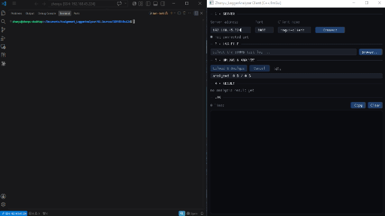
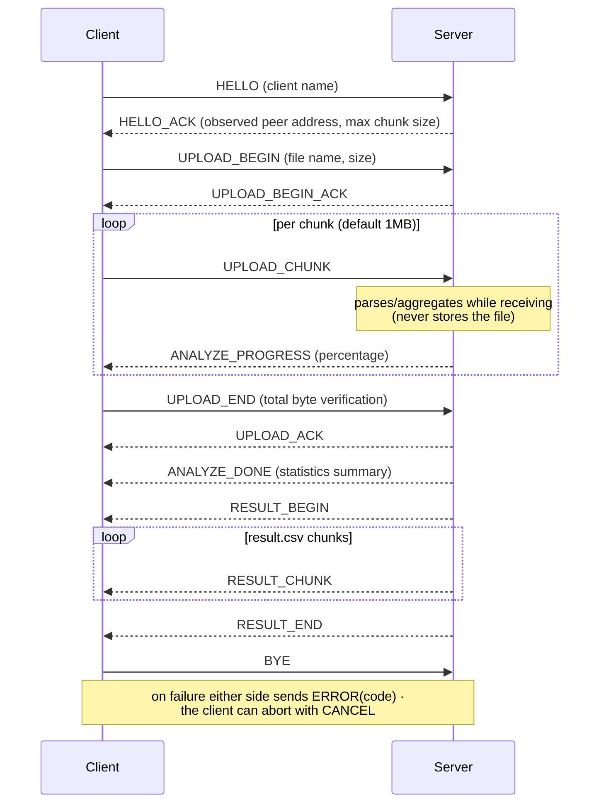

# Assignment_LoggerAnalyzer

[](https://github.com/svengalideck1138/Assignment_LoggerAnalyzer/actions/workflows/ci.yml)

A client-server system that uploads a large (~500MB) equipment log file over TCP,
parses and aggregates it on the fly, and returns the analysis result as `result.csv`.

- **Clients (two implementations, same wire protocol)**
  - C# WinForms app (Windows, .NET Framework 4.7.2)
  - C++17 Dear ImGui app (cross-platform: builds on Windows and Linux from
    the same sources) — persistent connection, status LED, built-in file
    browser, live per-module statistics
- **Server**: Linux daemon (C++17, libuv) — streaming parse/aggregation on receive, resident memory stays at a few MB

<p align="center">
  <br>
  <em>C# WinForms client (Windows) — uploading the 500MB log and receiving result.csv</em>
</p>

<p align="center">
  <br>
  <em>C++ ImGui client (cross-platform) — persistent connection, live per-module statistics</em>
</p>

## Repository Layout

```
Assignment_LoggerAnalyzer/
├── 01.Sources/
│   ├── CLIENT/
│   │   ├── CSHARP/              # WinForms client (Visual Studio solution)
│   │   │   └── Network/         # TCP layer (Protocol.cs = same wire contract as the server)
│   │   └── CPP/                 # cross-platform ImGui client (CMake project)
│   │       ├── build_windows.bat    # VS2022 build
│   │       ├── build_linux.sh       # Linux build (checks X11/OpenGL deps)
│   │       ├── 3rdparty/        # Dear ImGui 1.92 + GLFW 3.4, vendored as source only
│   │       └── src/
│   │           ├── net/         # RAII sockets, worker-thread transfer engine
│   │           └── ui/          # ImGui panels, built-in file browser
│   └── SERVER/                  # Linux server source (CMake project)
│       ├── 01.PreInstallation.sh    # 1) install build tools, SSH, firewall setup
│       ├── 02.build_project_linux.sh # 2) build libuv + build server + run
│       ├── 03.DaemonRegistration.sh # 3) register as a systemd daemon
│       ├── 3rdparty/            # bundled libuv (static) and spdlog (header-only)
│       ├── packaging/           # systemd service template
│       └── src/
│           ├── app/             # Config (CLI options), Daemon (double fork), Signals
│           ├── net/             # libuv TCP server, frame encoding/decoding
│           ├── parse/           # log line splitting and validation
│           ├── analyze/         # aggregation, CSV result generation
│           └── util/            # spdlog-based logger
└── 02.Release/
    ├── release - client/
    │   ├── CSHARP/              # prebuilt Windows client (.exe)
    │   └── CPP/linux-aarch64/   # prebuilt Linux ImGui client (aarch64)
    └── release - server/        # prebuilt Linux server (aarch64) + service file
```

## Quick Start (prebuilt binaries)

No build step required. Packaged binaries for **Linux x86_64, Linux aarch64
and Windows x64** — each release ships with a `SHA256SUMS` file — are on the
[Releases page](https://github.com/svengalideck1138/Assignment_LoggerAnalyzer/releases);
the copies below live in `02.Release/` inside the repository.

**Server (Linux):**

```bash
cd "02.Release/release - server"
chmod +x Zhenyu_LoggerAnalyzer
./Zhenyu_LoggerAnalyzer --port 8088 --verbose
```

**Client (Windows, C# WinForms):**

Run `02.Release/release - client/CSHARP/Individual Assignment01_UI.exe`,
enter the server IP and port (default 8088), and connect.

**Client (Linux, C++ ImGui):**

```bash
cd "02.Release/release - client/CPP/linux-aarch64"
chmod +x Zhenyu_LoggerClient
./Zhenyu_LoggerClient
```

> Run it from a desktop session — it opens a window. The binary links against
> the system OpenGL and libstdc++, so no extra packages are needed to run it.

> The prebuilt Linux binaries are aarch64 (built on Raspberry Pi OS, glibc
> 2.38). On any other architecture or an older glibc, build from source — the
> build scripts install what they need; see below.

> There is no prebuilt Windows binary for the C++ client yet — build it in
> about a minute; see
> [Client — C++ ImGui](#client--c-imgui-windows-and-linux) below.

> If the server runs on another machine, open TCP port 8088 in its firewall
> (`01.PreInstallation.sh` sets up the ufw rule automatically).

## Building from Source

### Server (Linux)

After `git clone`, run the scripts in this order:

```bash
cd 01.Sources/SERVER
bash 01.PreInstallation.sh            # once: install packages + SSH/firewall setup
bash 3rdparty/libuv/build_linux.sh    # once per machine: build bundled libuv against the local glibc
bash 02.build_project_linux.sh        # build server -> run
bash 03.DaemonRegistration.sh         # (optional) register systemd service: start at boot + auto-restart
```

- **Why build libuv first**: the repository ships a prebuilt `libuv_a.a`,
  but a static archive is tied to the glibc of the machine that built it.
  Rebuilding it locally (a few minutes, once per machine) guarantees the
  link succeeds. If you skip this step and the glibc versions differ, the
  final link fails with errors like
  `undefined reference to '__isoc23_strtol'` — the fix is to run the
  libuv build script (or `REBUILD_LIBUV=1 bash 02.build_project_linux.sh`,
  which does the same thing)
- Supported distros: Debian family (apt), RHEL family (dnf), Arch family (pacman) / x86_64, aarch64
- Build options via environment variables: `BUILD_TYPE=Debug`, `SANITIZE=address`, `NO_RUN=1`, `PORT=8090`, etc.
- libstdc++/libgcc are statically linked, so the binary runs even when the build
  machine and the target machine have different GLIBCXX versions
- On systems without systemd (WSL, containers), use the server's own daemon mode:
  `./build/Zhenyu_LoggerAnalyzer --daemon --port 8088`

**Server CLI options:**

| Option | Description |
|--------|-------------|
| `-p, --port <n>` | TCP port (default 8088) |
| `--log <path>` | log file path (default: stderr only) |
| `--foreground` | run in foreground (default) |
| `--daemon` | detach via double fork |
| `--pidfile <path>` | daemon PID file (default /tmp/Zhenyu_LoggerAnalyzer.pid) |
| `-v, --verbose` | debug-level logging |

### Client — C# WinForms (Windows)

Open `01.Sources/CLIENT/CSHARP/Individual Assignment01_UI.sln` in
Visual Studio 2022 and build (.NET Framework 4.7.2).

### Client — C++ ImGui (Windows and Linux)

The same sources build on both platforms. Dear ImGui and GLFW are vendored
as **source only** (no prebuilt binaries), so any glibc or architecture
compiles them locally, and the wire protocol comes from including the
server's `Protocol.h` directly — one header, zero drift.

**Windows** (Visual Studio 2022 with the C++ workload):

```bat
cd 01.Sources\CLIENT\CPP
build_windows.bat
```

**Linux:**

```bash
cd 01.Sources/CLIENT/CPP
bash build_linux.sh
```

The script checks for the C++ toolchain, CMake and the X11/OpenGL development
headers, and installs whatever is missing through apt / dnf / pacman (it asks
for your sudo password). `SKIP_DEPS=1` checks only and stops instead. To
install them yourself beforehand:

```bash
sudo apt-get install -y build-essential cmake xorg-dev libgl1-mesa-dev
# or: bash ../../SERVER/01.PreInstallation.sh --with-client-gui
```

GLFW is built with the X11 backend only, because its Wayland backend also
needs `wayland-scanner` and `wayland-protocols`. The X11 build runs on a
Wayland session through XWayland; pass `-DGLFW_BUILD_WAYLAND=ON` to CMake for
a native Wayland build.

Run `build/Release/Zhenyu_LoggerClient.exe` (Windows) or
`build/Zhenyu_LoggerClient` (Linux, from a desktop session).

## Analysis Tasks and result.csv

Target log format:

```
[YYYY-MM-DD_HH:MM:SS.ffffff][PID][TID][SEQ] BYDA::<Module>: <payload>
```

The server performs the two analysis tasks required by the assignment.

- **Task 1 — module occurrence counts per time slot**: each line's timestamp is
  grouped into an hourly bucket (`YYYY-MM-DD HH:00`) and occurrences are counted
  per module per bucket. → `HOURLY_MODULE_COUNTS` section of the CSV
- **Task 2 — average speed**: the speed value is extracted from every line
  containing `spd` and averaged over the whole file (Neumaier compensated
  summation keeps the floating-point error down). → `spd_average` row in the
  CSV `SUMMARY` section

Beyond the two answers, `result.csv` includes verification/diagnostic sections:
total/accepted/rejected line counts, per-reason rejection statistics with the
first occurrence of each reason (line number, byte offset, escaped excerpt),
the list of module names outside the whitelist, and min/max speed values.
The file starts with a UTF-8 BOM so Excel opens it correctly, and follows
RFC 4180 quoting rules.

## Measured Results (the provided 500MB log)

Environment: server on a Raspberry Pi CM4 (eMMC 32GB, 8GB RAM, aarch64
Linux), client on Windows 11 x64, wired LAN (~112MiB/s effective). Numbers
are **self-reported by the server** in `ANALYZE_DONE` (elapsed time; peak
RSS read from `/proc/self/status` VmHWM).

| Metric | Required / recommended | Measured |
|--------|------------------------|----------|
| Peak server memory | ≤ 50MB recommended | **2.8 MiB** — about **1/17 of the budget** (2.3 MiB on a Wi-Fi re-run) |
| Loading the whole 500MB into memory | forbidden | **never** — 1MiB chunks are parsed and discarded; nothing is written to disk either |
| Lines completed | must finish every valid line | **3,483,502 of 3,483,528** — 26 corrupted lines (0.00075%) skipped, zero crashes |
| Average speed (task 2) | — | **137500.000000** over 580,661 samples (without the module whitelist it would read 9.18×10¹⁵) |
| Upload + analysis wall time | — | **~4.3s** on LAN — analysis streams with the upload, so it finishes when the upload does (110s on 4.4MiB/s Wi-Fi: time scales with bandwidth, memory does not) |
| Memory leaks | zero (rule S2) | **0** — ASan/LeakSanitizer re-run on every push in CI |

A requirement-by-requirement compliance matrix (every assignment item →
implementation → evidence) is kept in
[03.Docs/requirements-compliance.md](03.Docs/requirements-compliance.md).

## Network Architecture

### Overview

```mermaid
flowchart LR
    subgraph WIN["Client — C# WinForms · C++ ImGui"]
        direction TB
        UI["UI thread<br/>file picker · progress bar · result download<br/>(Form1 / ImGui App)"]
        CONN["Transfer engine<br/>C#: async/await · C++: worker thread + poll"]
        PROT_C["Wire protocol<br/>C#: Protocol.cs · C++: includes server Protocol.h"]
        UI --> CONN --> PROT_C
    end

    subgraph LINUX["Linux server (C++17, single-threaded libuv event loop)"]
        direction TB
        SRV["TcpServer<br/>listen / accept"]
        SES["TcpSession<br/>session state machine · idle timeout"]
        DEC["FrameDecoder<br/>header validation · frame reassembly"]
        SPL["LineSplitter → LogLine<br/>streaming parse · layered validation"]
        AGG["Aggregator<br/>hourly buckets · speed accumulator"]
        CSV["CsvWriter<br/>builds result.csv"]
        SRV --> SES --> DEC --> SPL --> AGG --> CSV
        CSV -. "RESULT_* frames back" .-> SES
    end

    PROT_C <-->|"TCP :8088<br/>BYDA frames"| SRV
```



Internal boundaries on the server are interface-based: the application starts
the server through `ITcpServer`, and the transport layer reaches the
parse/aggregate layers only through `ISessionCallback` / `IPayloadSink`.

### Wire Protocol

`src/net/Protocol.h` on the server is the single source of truth.
The C# client mirrors the contract in `Network/Protocol.cs`; the C++ client
goes one step further and **includes the server header directly** (enforced
by its CMake configure step), so client and server can never drift apart.

- Frame = **16-byte fixed header + payload**, all integers big-endian
- Header: magic `0x42594441 ("BYDA")` · version · msg_type · flags · payload_len (8B)
- Byte-by-byte serialization instead of struct memcpy — independent of
  compiler/platform ABI differences (padding, alignment)
- Payload cap of 4MB — prevents a forged header from triggering a huge
  buffer allocation

**Message flow:**



### Server: libuv Event Loop

- A single-threaded event loop handles all socket I/O asynchronously —
  no thread synchronization cost, no data races by construction
- Application code touches the transport layer only through the
  `ITcpServer` / `ISessionCallback` / `IPayloadSink` interfaces, so swapping
  the transport implementation never touches `main.cpp`

### Clients: the UI Thread Never Blocks

Both clients keep the UI responsive through a 500MB upload
(no "Not Responding" state), each with the idiomatic tool of its stack:

- **C# WinForms**: all I/O is `async/await`; the connect timeout is a
  `Task.WhenAny` race whose losing task is always cleaned up
- **C++ ImGui**: a dedicated worker thread owns the socket (non-blocking +
  `poll`, 250ms cancel slices, 20s write-stall detection); the UI copies a
  mutex-guarded snapshot each frame, so no torn values ever render
- The C++ client keeps a **persistent session**: Connect/Disconnect toggle,
  repeated uploads over one connection, a status LED (200ms blink while
  connected/busy, PWM-style breathe on failure), and local-time-stamped logs
- UI components on both: file picker, upload button, real-time progress bar,
  result download button

### Network Robustness

- If the connection is cut in the middle of a transfer, both sides handle
  the socket error without crashing and return every resource they were using
- Server: `SIGPIPE` is ignored (a client vanishing mid-upload cannot kill the
  process), per-session idle timeout, and an error tears down only that
  session while the listener keeps running
- Graceful shutdown: on `SIGTERM` the server closes the listening socket,
  finishes in-flight sessions, then releases every libuv handle before
  exiting (`uv_loop_close` verifies zero handles remain)

## Design Patterns (GoF)

Patterns are applied only where they solve an actual problem in this
system. Each one below points at the real source.

### Factory Method — creation behind an interface

`main.cpp` never names a concrete server type: it asks the factory and
receives an `ITcpServer`. Swapping the transport implementation (or
substituting a fake for a test harness) changes one line inside the
factory, not the application. The C# client mirrors the same idea with
`ConnectionFactory` → `IServerConnection`.

```cpp
// 01.Sources/SERVER/src/net/ServerFactory.cpp
std::unique_ptr<ITcpServer> ServerFactory::createTcpServer(uv_loop_t* loop, const Config& cfg) {
    return std::make_unique<TcpServer>(loop, cfg);
}

// 01.Sources/SERVER/src/main.cpp — the application only knows the interface
std::unique_ptr<byda::ITcpServer> server = byda::ServerFactory::createTcpServer(&loop, cfg);
```

### Strategy — pluggable payload handling in the frame decoder

`FrameDecoder` always decodes frames the same way, but *what happens to
the payload bytes* is a swappable strategy (`IPayloadSink`). Small
control frames are buffered; `UPLOAD_CHUNK` payloads are streamed
zero-copy from the receive buffer straight into the parser. This
strategy switch is the exact point that keeps a 500MB upload at a few
MB of resident memory.

```cpp
// 01.Sources/SERVER/src/net/FrameDecoder.cpp
streaming_ = (sink_ != nullptr) && sink_->stream_payload(header_.type, header_.payload_len);
if (!streaming_) {
    payload_.resize(static_cast<std::size_t>(header_.payload_len));  // buffer: control frames
}
// ...
if (streaming_) {
    sink_->payload_chunk(data + consumed, take);  // stream: upload chunks, zero-copy
}
```

### Observer — lifecycle and progress notifications

A session never knows its owner's concrete type. It publishes "all of
my handles are closed" through `ISessionCallback`, and the owner reacts
by destroying the session object at the only moment that is safe. The
C# client uses the same pattern between threads: the worker publishes
`UploadProgress` snapshots through `IProgress<T>`, and `Progress<T>`
marshals every notification onto the UI thread — no `Invoke`
boilerplate anywhere.

```cpp
// 01.Sources/SERVER/src/net/ISessionCallback.h
class ISessionCallback {
public:
    // Called once the session has closed every handle it owns, i.e. at
    // the only moment the owner can safely destroy the session object.
    virtual void on_session_closed(std::uint32_t id) = 0;
};
```

```csharp
// 01.Sources/CLIENT/CSHARP/Form1.cs — the UI thread observes the worker
var progress = new Progress<UploadProgress>(OnUploadProgress);
AnalyzeResult result = await Task.Run(
    () => conn.UploadAsync(path, progress, netLog, token), token);
```

### Facade — one small API over the whole transfer engine

The ImGui UI drives a worker thread, a non-blocking socket, frame
encoding, the cancel handshake and progress accounting through a
handful of methods; everything else is hidden inside `TransferClient`.
The UI never touches a socket.

```cpp
// 01.Sources/CLIENT/CPP/src/net/Transfer.h
class TransferClient {
public:
    void connect(std::string host, std::uint16_t port, std::string client_name);
    void disconnect();
    void start_upload(std::string file_path);
    void request_cancel() noexcept;
    Snapshot snapshot() const;   // the UI reads a torn-free copy every frame
    // ...
};
```

## Memory Optimization Strategy

Assignment constraint: *loading the whole 500MB file into memory at once is
strictly forbidden; keeping peak process memory under 50MB is recommended.*

- **Streaming parse**: each upload chunk (default 1MB) is parsed and
  aggregated line by line as it arrives, then discarded. Neither the file nor
  the chunks are ever accumulated, so **resident memory stays at a few MB**
  regardless of input size (self-measured via `/proc/self/status`)
- **Minimal aggregation state**: hourly buckets live in a **sorted
  `std::vector` with a last-bucket cache** instead of a `std::map` (which
  allocates a node per entry) — logs are chronological, so nearly every line
  hits the cache, and 25 buckets fit in 1.2KB of contiguous memory
- **Allocation-free hot path**: line validation is pure `std::string_view`
  index checks — no regex, no substring copies, no exceptions
- **Upper-bound guards**: caps on bucket count (10,000), rejected module
  names (64), and line length (8KB) stop adversarial input from inflating
  the containers

## Corrupted Data Handling

Assignment condition: *about 0.001% of the lines are intentionally corrupted
(missing brackets, unexpected characters, format mismatches). The server must
never crash on them; it must skip and record them, then finish parsing every
remaining valid line.*

**Layered validation** — each line goes through staged structural checks, and
a failure is classified into one of 8 reasons (`TooShort`,
`MissingOpenBracket`, `BadTimestamp`, `GarbagePayload`, `MissingCloseBracket`,
`MissingBydaTag`, `BadModuleName`, `UnknownModule`). Per-reason counts and the
first occurrence of each reason (line number, byte offset, escaped excerpt)
go straight into the diagnostic section of `result.csv`.

**Module whitelist** — some corrupted lines have a perfectly valid header and
a poisoned payload:

```
[...] BYDA::BeyondLimit: spd[888888888888888888888.88]
```

Such a line passes every structural check. Without the whitelist of the 5
known modules, these 6 lines would swamp the 580,661 valid samples and the
average speed would come out as 9.18×10¹⁵ instead of 137,500. A speed range
gate (0 to 10⁹) sits behind the whitelist as a second layer of defense.

**Exception-free hot path** — `parse_log_line()` is `noexcept` and never
throws. Throwing on every corrupted line would trigger stack unwinding per
line and collapse throughput under adversarial input. A rejected line only
records its reason and parsing moves straight on, so every valid line is
processed no matter how many corrupted lines appear.

## RAII / Memory Management Compliance

The assignment's strict rule (no manual memory management anywhere) is met.

- **Zero** occurrences of `new` / `delete` / `malloc` / `free` / `calloc` /
  `realloc` in first-party C++ sources — both the server (`SERVER/src/`)
  and the C++ client (`CLIENT/CPP/src/`), excluding bundled 3rdparty —
  re-verified on every push by the CI forbidden-keyword scan
- Note for anyone grepping the whole repository: the C# WinForms client
  naturally contains C#'s `new` keyword. That is **garbage-collected managed
  allocation**, not the raw-pointer manual allocation the rule forbids —
  the rule (and the scan) therefore applies to the C++ sources
- All dynamic resources are owned by `std::unique_ptr`
  (`std::make_unique`) and STL containers (`std::vector`, `std::string`,
  `std::array`)
- OS resources (sockets, event loop, PID file) are wrapped in RAII types as
  well, so every path — including error paths — releases them automatically
- The `BYDA_SANITIZE=address` build option enables
  AddressSanitizer/UBSan verification

## Verification

Every push runs the [CI pipeline](.github/workflows/ci.yml); the badge at the
top reflects the latest result. What it proves:

| Check | What it demonstrates |
|-------|----------------------|
| **Forbidden keyword scan** | Zero `new`/`delete`/`malloc`/`calloc`/`realloc`/`free` tokens in first-party C++ sources, comments included — the assignment's strict rule S1, re-verified on every commit |
| **36 unit tests** | All 8 rejection reasons, the module whitelist (`BeyondLimit` kill), spd range/anchor/malformed-value gates, chunk-split invariance of the line splitter, oversize-line memory guard, hourly bucketing and averages, bucket-count cap under adversarial timestamps, frame header golden vectors, truncated/forged frame defense, CSV sections and quoting — full run output below |
| **ASan + UBSan re-run** | The same tests pass under AddressSanitizer and UndefinedBehaviorSanitizer — no leaks, no out-of-bounds, no UB on the parsing paths |
| **Disconnect + cancel e2e (P2)** | A scripted client uploads, then kills the connection with a TCP RST mid-transfer; the server must survive and complete a full follow-up session whose statistics and result.csv match the expected values exactly. A third session cancels mid-upload with `CANCEL`, must receive `ERROR(Cancelled)`, then re-uploads **on the same connection** — pinning the cancel contract both GUI clients rely on |
| **Windows + Linux builds** | The C++ client and the unit tests compile and pass on both MSVC and GCC on every push |

### Unit test results — 36 / 36 passed

The same test binary runs in three configurations: Windows (MSVC),
Linux (GCC) and Linux under ASan + UBSan — all green in CI on every
push. A captured local run:

<details>
<summary><b><code>byda_tests</code> — 36 test(s), 0 failure(s)</b> (click to expand)</summary>

```
[ OK ] accepts_valid_line_and_extracts_fields
[ OK ] accepts_all_whitelisted_modules
[ OK ] rejects_too_short
[ OK ] rejects_missing_open_bracket
[ OK ] rejects_bad_timestamp
[ OK ] rejects_garbage_payload
[ OK ] rejects_missing_close_bracket
[ OK ] rejects_missing_byda_tag
[ OK ] rejects_bad_module_name
[ OK ] whitelist_shoots_down_beyondlimit
[ OK ] spd_range_gate_is_second_defense
[ OK ] spd_boundaries
[ OK ] spd_anchor_is_exact
[ OK ] spd_malformed_values_are_ignored
[ OK ] chunk_split_invariance
[ OK ] raw_bytes_cover_the_whole_stream
[ OK ] carry_joins_lines_across_fragments
[ OK ] oversize_line_is_dropped_not_accumulated
[ OK ] oversize_across_fragments
[ OK ] buckets_group_by_hour
[ OK ] spd_average_min_max
[ OK ] corrupt_lines_are_counted_not_fatal
[ OK ] adversarial_timestamps_cannot_inflate_buckets
[ OK ] reset_clears_everything
[ OK ] header_encode_decode_roundtrip
[ OK ] decodes_whole_frame
[ OK ] decodes_frame_fed_one_byte_at_a_time
[ OK ] decodes_two_frames_in_one_fragment
[ OK ] rejects_bad_magic
[ OK ] rejects_bad_version
[ OK ] rejects_forged_giant_length
[ OK ] truncated_header_waits_for_more
[ OK ] payload_reader_survives_truncated_payload
[ OK ] csv_contains_both_assignment_answers
[ OK ] csv_disposition_counts_add_up
[ OK ] csv_quotes_fields_with_commas

36 test(s), 0 failure(s)
```

</details>

Run everything locally:

```bash
# unit tests (any platform)
cmake -S 01.Sources/SERVER/tests -B tests-build && cmake --build tests-build
ctest --test-dir tests-build --output-on-failure
```

```bash
# forced-disconnect + cancel regression (Linux, server built first)
bash 01.Sources/SERVER/tests/run_e2e.sh
```

```bash
# forbidden keyword scan
bash tools/check_forbidden.sh
```

## Branch Strategy

| Branch | Purpose |
|--------|---------|
| `main` | stable integration |
| `dev/client` | client development |
| `dev/server` | server development |
| `release` | prebuilt release binaries |

## Technology Stack

| Part | Technology |
|------|------------|
| Server | C++17, libuv 1.51.0 (statically linked), spdlog, CMake 3.15+ |
| Client (C#) | C#, .NET Framework 4.7.2, WinForms |
| Client (C++) | C++17, Dear ImGui 1.92, GLFW 3.4, OpenGL 3, CMake 3.16+ |
| Deployment | systemd service, automated shell scripts |
